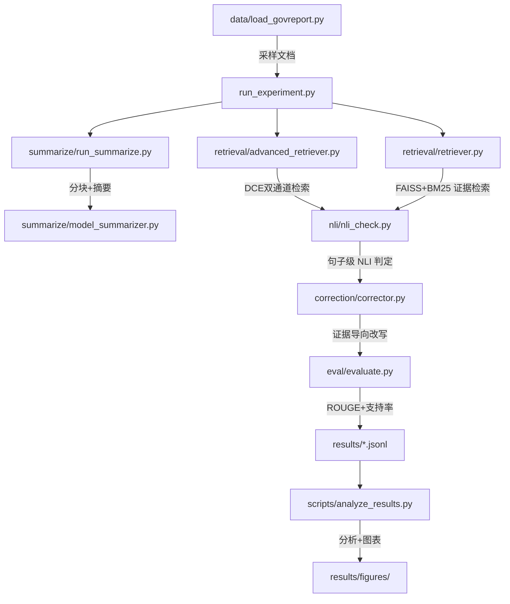

## 📊 LongFact 项目全景分析

### 🎯 项目目标
这是一个**长文档摘要事实一致性评测与纠错系统**，属于 NJUniversity 的课程/研究项目。完整覆盖作业三大任务：

- **任务 3.1（基线）**：分块摘要 → 证据检索 → NLI 事实判定 → 纠错 → ROUGE + 支持率评估
- **任务 3.2（分析）**：摘要长度分桶分析 + 纠错案例导出（≥10 案例，含成功/失败）
- **任务 3.3（进阶-检测方向）**：DCE 双通道证据检索 —— 原创检测改进方案

---

### 🏗️ 项目架构（模块划分）

| 模块 | 文件 | 职责 |
|------|------|------|
| **数据加载** | load_govreport.py | 加载 GovReport 数据集，支持 validation/test split，处理多种字段名 |
| **配置中心** | config.py | 统一管理模型名、路径、精度、缓存等配置，支持 .env.local 覆盖 |
| **摘要生成** | run_summarize.py + model_summarizer.py | 分块→摘要→融合，支持 Qwen2.5-1.5B 等 HF 模型，CPU/GPU/8bit/fp16 多模式 |
| **证据检索** | retriever.py | Sentence-BERT + FAISS（Flat/HNSW/IVF）+ 可选 BM25 混合检索，嵌入缓存 |
| **进阶检索** | advanced_retriever.py（新增） | DCE 双通道证据检索：语义+关键词融合、自适应 Top-K、轻量级重排序、条件证据扩展 |
| **NLI 判定** | nli_check.py | `facebook/bart-large-mnli` 做 ENTAILMENT/CONTRADICTION/NEUTRAL 三分类，支持批量+分桶 |
| **纠错** | corrector.py | 对被判不支持的句子，基于证据段用 LLM 生成改写 |
| **评估** | evaluate.py | ROUGE-1/2/L + 句子级支持率计算 |
| **工具函数** | hf_helpers.py | 统一的 HF 模型/分词器安全加载（8bit、fp16、CPU fallback） |
| **实验入口** | run_experiment.py | 端到端管线，支持 `--retrieval_strategy baseline|dce` 策略切换对比实验 |
| **引导脚本** | bootstrap_local.py | 一键安装依赖、下载数据集、预热模型缓存 |

---

### 📦 技术栈

| 组件 | 技术选型 |
|------|---------|
| **摘要模型** | `Qwen/Qwen2.5-1.5B-Instruct`（默认） |
| **NLI 模型** | `facebook/bart-large-mnli` |
| **检索嵌入** | `sentence-transformers/all-MiniLM-L6-v2` |
| **向量索引** | FAISS（Flat / HNSW / IVF） |
| **关键词检索** | BM25（rank_bm25） |
| **评估指标** | ROUGE-1/2/L（rouge-score） |
| **精度选项** | fp32 / fp16 / 8-bit（bitsandbytes） |
| **进度显示** | tqdm（多 position 布局） |
| **测试框架** | pytest + monkeypatch + fake torch |

---

### 🔧 关键设计决策

1. **模块级缓存**：`HFLocalSummarizer`、`Corrector`、`Retriever`、`AdvancedRetriever` 都实现了模块级缓存，避免重复加载大模型
2. **嵌入缓存**：Retriever 将嵌入向量存为 `.npz`，FAISS 索引存为 `.index`，按内容 hash 去重
3. **渐进式精度加载**：每个模型加载都遵循 8bit → fp16 → 标准 pipeline 的 fallback 链
4. **NLI 长度分桶**：`check_batch()` 按 token 长度分桶（64/128/256/512/1024），减少 padding 浪费
5. **离线友好**：通过 `HF_DATASETS_OFFLINE=1` + `local_files_only=True` 支持纯离线运行
6. **DCE 双通道检索**：语义 embedding + 关键词 BM25 融合，自适应 Top-K（短句 3/中等 5/长句 7），零额外模型开销的轻量级重排序
7. **策略可切换**：`--retrieval_strategy baseline|dce` 让基线对比实验一键运行

---

### 📁 结果输出结构

每条 JSONL 记录包含：
- `id`, `reference`, `prediction`（原始摘要）, `corrected`（纠错后摘要）
- `support_rate` / `corrected_support_rate`（纠错前后句子级支持率）
- `rouge` / `rouge_corrected`（ROUGE 分数）
- `details` / `corrected_details`（逐句 NLI 结果 + 证据）
- `summarization_debug`（分块信息）
- `timing`（分阶段耗时：摘要、检索、NLI、纠错、ROUGE、总时间）
- `prediction_length` / `corrected_length`（句子数/字符数/token 数）

---

### 🧪 已有实验结果

results 目录下已有完整的 **n=500 样本** 实验结果：
- `full_n500.jsonl`：完整实验数据
- `analysis_summary.json` + `bucket_metrics.csv`：按 token 长度的分桶分析
- `correction_cases.json` + `selected_correction_cases.jsonl`：纠错案例
- `case_chart_summary.json` + `figures/`：图表与可视化

---

### 📋 脚本工具集

| 脚本 | 功能 |
|------|------|
| analyze_results.py | 整体指标、长度分桶、案例筛选 |
| select_correction_cases.py | 从最优/最差纠错案例中选择 Top-N |
| generate_case_charts.py | 为案例生成 PNG 图表与 JSON 摘要 |
| generate_results_table.py | 逐样本 ROUGE+NLI 统计表 |
| merge_results.py | 多机结果合并（按 id 去重） |
| inspect_results.py | 快速查看结果文件关键字段 |
| prebuild_indices.py | 预构建 FAISS 索引与嵌入缓存 |
| benchmark_local.py | 不同精度配置下的性能对比 |
| check_env_local.py | 本地环境依赖检查 |

---

### 🧪 测试体系

- `conftest.py`：确保项目根在 `sys.path`
- `test_unit.py`：chunk/fuse、FallbackSummarizer、sentence_split、support_rate、Corrector fallback
- `test_extended.py`：NLI check_with_evidence 策略（max/majority）、analyze_results 函数
- `test_retriever_nli.py`：Retriever build_index/query、NLI is_supported、**DCE AdvancedRetriever 双通道/重排序/批量查询**（monkeypatch 注入 fake torch/faiss）

当前状态：**16/16 测试全部通过**。

---

### 📝 改进计划（longfact-improvement-plan-1.md）

规划了 4 个阶段（全部已完成）：
1. ✅ 稳定基线输出字段
2. ✅ 实现长度分桶分析（Task 3.2.1）
3. ✅ 实现纠错前后对比 + 案例导出（Task 3.2.2）
4. ✅ DCE 双通道证据检索（Task 3.3 检测方向）—— 已实现，16 项测试通过

---

### ⚠️ 已知限制与注意事项

- `bitsandbytes` 在 Windows 上标记为可选（`platform_system != "Windows"`）
- 8GB 显存是约束条件，需要 fp16/8bit + batch_size 调优
- 单样本也可能很慢（长文档→多 chunk→多句子 NLI→纠错）
- DCE 双通道检索在无 BM25 环境下自动降级为纯语义通道，不中断管线

---
